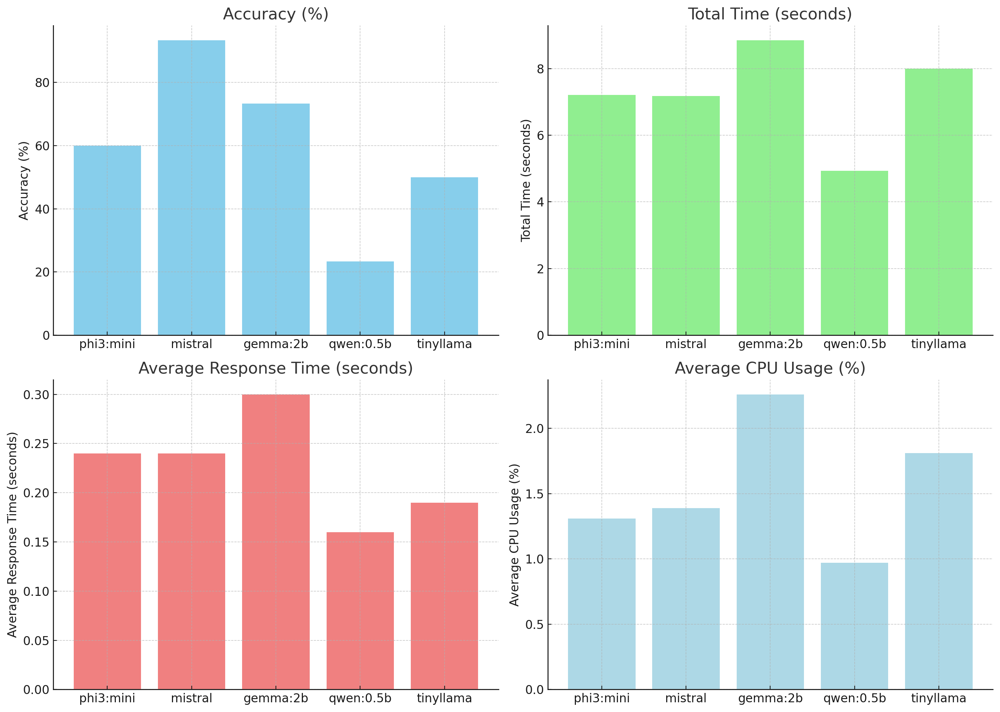
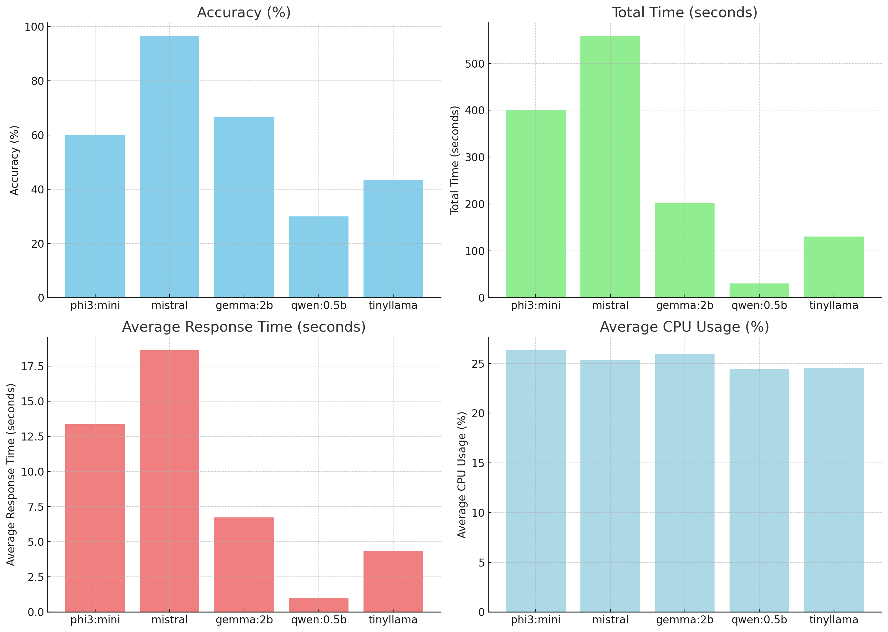

## Ollama Model Benchmark

* This repository contains a Python script and results for a simplified benchmarking of various Ollama models.

---

Example : 
```
python3 benchmark_ollama_model.py -m Tinyllama
```


<LeftMouse>### Desktop


### Laptop

### Desktop


